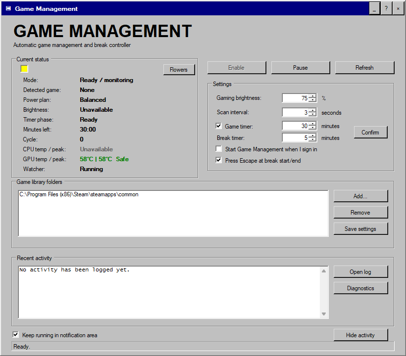
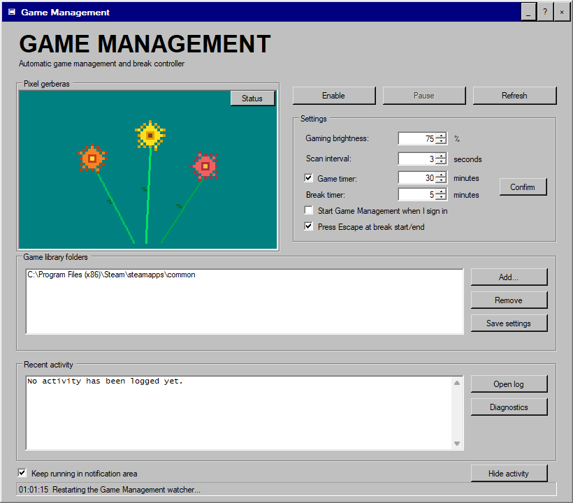
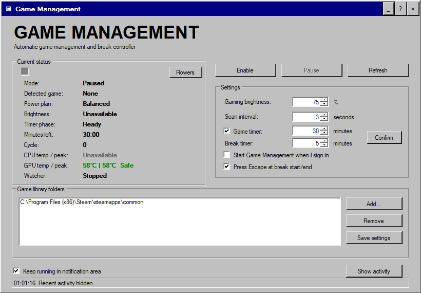

# Game Management

Game Management is a Windows desktop gaming utility with a deliberately retro Windows 98 interface. It detects games in configured library folders, applies a dedicated AC-only performance plan, controls supported built-in display brightness, manages game/break timers, and restores the previous system state when the game closes. It does not change game process priority.

> **Notice:** This code was created entirely by AI. The application is intended for personal use only.



## Features

- Automatic game detection across configured folders and Steam libraries
- AC-power-only activation
- Dedicated Windows power plan with exact plan restoration
- No game process-priority changes
- Configurable gaming brightness with restoration
- Repeating game and break timers with a visible, repeating alarm and cycle counting
- Consistent Windows 98 styling across the main window, timer alarm, session summary, and installer
- Optional automatic Escape key at break start/end, sent only to the verified game window
- Automatic dashboard show during breaks and hide when play resumes
- Live CPU/GPU temperatures, color conditions, and per-session temperature peaks
- Read-only CPU-temperature integration with an already-running MSI Afterburner
- A saved session history with game, date/time, duration, cycles, and CPU/GPU peaks
- Taskbar and notification-area controls
- Low-overhead idle tray mode with full one-second temperature monitoring during games
- Collapsible activity log
- Animated Windows 98-style pixel-gerbera panel
- Single-file graphical installer and registered uninstall support

## Hardware compatibility

The universal Windows installer supports desktop and laptop PCs using NVIDIA GeForce RTX 20- or 30-series graphics, including Ti, SUPER, and Laptop GPU variants. RTX detection is informational. On NVIDIA systems, the dashboard uses a read-only `nvidia-smi` temperature query; Game Management does not change NVIDIA drivers, clocks, voltages, firmware, thermal targets, or vendor performance modes.

Setup uses the current user's resolved Documents folder, falls back to a compatible Windows power-plan base when needed, and skips optional power settings that a PC's firmware does not expose. The application can also run with other GPU brands; built-in display brightness control remains optional and unsupported external monitors are left unchanged.

## Install

Download and run [`GameManagement-Setup.exe`](dist/GameManagement-Setup.exe). Windows may show an Unknown publisher warning because the executable is not digitally signed.

The installer places the application in `Documents\GameManagement`, creates Desktop and Start Menu shortcuts, starts the watcher, and adds Game Management to Windows Installed Apps. Existing settings are preserved during upgrades.

## Safety

Game Management does not control process priority, fan firmware, BIOS settings, voltages, thermal modes, thermal limits, or CPU/GPU clocks. Its temperature monitor is read-only. On this Lenovo, CPU temperature can be read from MSI Afterburner's monitoring data while MSI Afterburner is running; otherwise Lenovo/Windows fallbacks are tried and Unavailable is shown. Game Management only activates on AC power. Pausing or uninstalling restores the captured power plan and brightness. Setup also restores a legacy priority snapshot if an older version left one behind during an interrupted session.

## Build from source

On 64-bit Windows with .NET Framework 4 installed:

```powershell
powershell.exe -NoProfile -ExecutionPolicy Bypass -File .\Build-GameManagement.ps1
```

This compiles the AnyCPU application, runs the safety and RTX compatibility tests, and creates the single-file installer both one directory above the source folder and in `dist`.

## Verification

The v2.0.0 package was verified on September 14, 2026 before publication. The active product identity, executable, scripts, installer, internal identifiers, log, shortcuts, startup entry, uninstall entry, installation folder, and power plan use the Game Management name. Hidden idle operation avoids unnecessary sensor, timer-display, power-plan, brightness, and executable-path work; one-second temperature monitoring remains active during games and while the window is visible. The watcher contains no process-priority controls, and MSI Afterburner CPU temperature access remains read-only.

- AnyCPU application and installer compilation: **PASS**
- PowerShell safety, identity, sensor-access, portability, optimization, and interface-alignment suite: **34/34 checks passed**
- Embedded installer payload verification: **PASS** (exit code 0)
- RTX 20/30 compatibility classifier: **PASS** (exit code 0)
- Non-installing setup-window render smoke test: **PASS** (exit code 0)
- Root and `dist` installer copies: **identical**

The classifier test covers representative RTX 2060, 2070 SUPER, 2080 Ti, 3050 Laptop, 3060 Ti, 3070, 3080 Laptop, and 3090 names. This verifies detection and hardware-independent setup behavior; it is not a claim that the application was physically tested on every GPU model or PC configuration.

## Screenshots





## Project files

- `GameManagement.cs` — desktop interface
- `GameManagement.ps1` — background game watcher and timer controller
- `Install-GameManagement.ps1` — installation/configuration helper
- `Pause-GameManagement.ps1` — safe pause and restoration helper
- `Undo-GameManagement.ps1` — full restoration helper
- `Uninstall-GameManagement.ps1` — Windows uninstall workflow
- `GameManagementSetup.cs` — single-file graphical installer

See [CHANGELOG.md](CHANGELOG.md) for update history.
