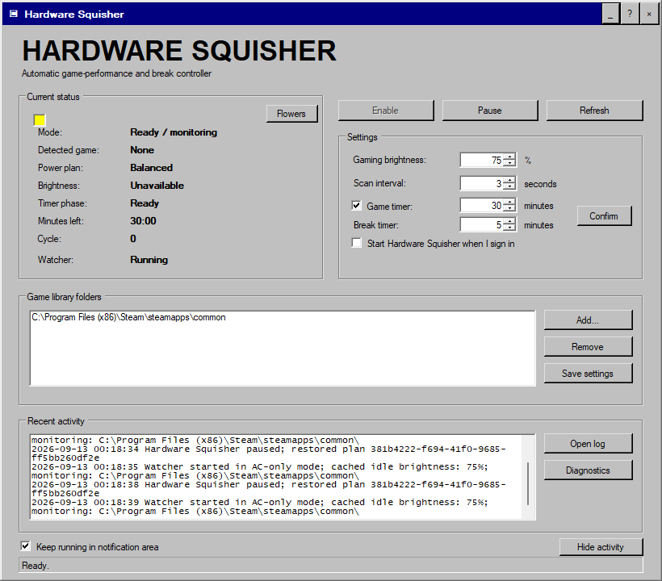
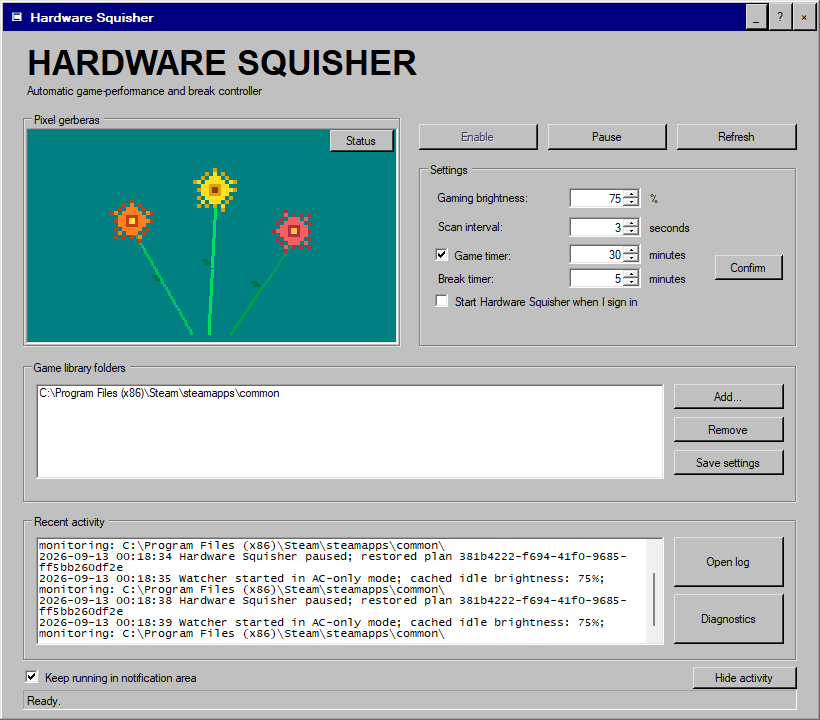
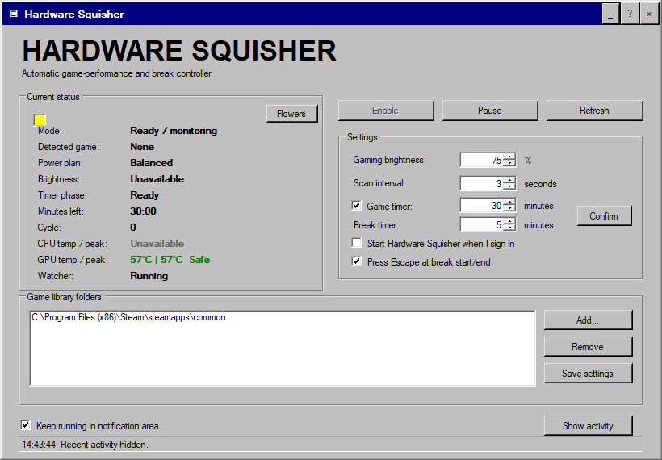

# Hardware Squisher

Hardware Squisher is a Windows desktop utility with a deliberately retro Windows 98 interface. It detects games in configured library folders, applies a dedicated AC-only performance plan, raises game process priority safely, controls supported built-in display brightness, and restores the previous system state when the game closes.

> **Notice:** This code was created entirely by AI. The application is intended for personal use only.



## Features

- Automatic game detection across configured folders and Steam libraries
- AC-power-only activation
- Dedicated Windows power plan with exact plan restoration
- High process priority with Above Normal fallback; Realtime is never used
- Configurable gaming brightness with restoration
- Repeating game and break timers with audible alerts and cycle counting
- Taskbar and notification-area controls
- Collapsible activity log
- Animated Windows 98-style pixel-gerbera panel
- Single-file graphical installer and registered uninstall support

## Hardware compatibility

The universal Windows installer supports desktop and laptop PCs using NVIDIA GeForce RTX 20- or 30-series graphics, including Ti, SUPER, and Laptop GPU variants. RTX detection is informational: Hardware Squisher remains GPU-independent and does not change NVIDIA drivers, clocks, voltages, firmware, or vendor performance modes.

Setup uses the current user's resolved Documents folder, falls back to a compatible Windows power-plan base when needed, and skips optional power settings that a PC's firmware does not expose. The application can also run with other GPU brands; built-in display brightness control remains optional and unsupported external monitors are left unchanged.

## Install

Download and run [`HardwareSquisher-Setup.exe`](dist/HardwareSquisher-Setup.exe). Windows may show an Unknown publisher warning because the executable is not digitally signed.

The installer places the application in `Documents\GameBoost`, creates Desktop and Start Menu shortcuts, starts the watcher, and adds Hardware Squisher to Windows Installed Apps. Existing settings are preserved during upgrades.

## Safety

Hardware Squisher does not control fan firmware, BIOS settings, voltages, thermal modes, or CPU/GPU clocks. It only activates on AC power. Pausing or uninstalling restores the captured power plan, brightness, and process priorities.

## Build from source

On 64-bit Windows with .NET Framework 4 installed:

```powershell
powershell.exe -NoProfile -ExecutionPolicy Bypass -File .\Build-HardwareSquisher.ps1
```

This compiles the AnyCPU application, runs the safety and RTX compatibility tests, and creates the single-file installer both one directory above the source folder and in `dist`.

## Verification

The v1.6.0 package was verified on September 13, 2026 before publication:

- AnyCPU application and installer compilation: **PASS**
- PowerShell safety and portability suite: **18/18 checks passed**
- Embedded installer payload verification: **PASS** (exit code 0)
- RTX 20/30 compatibility classifier: **PASS** (exit code 0)
- Non-installing setup-window render smoke test: **PASS** (exit code 0)
- Root and `dist` installer copies: **identical**
- Installer SHA-256: `B25360E1F621D28330956E1F942C6BA3B1B226F11C0484EE51FA7C0B27F30E54`

The classifier test covers representative RTX 2060, 2070 SUPER, 2080 Ti, 3050 Laptop, 3060 Ti, 3070, 3080 Laptop, and 3090 names. This verifies detection and hardware-independent setup behavior; it is not a claim that the application was physically tested on every GPU model or PC configuration.

## Screenshots





## Project files

- `HardwareSquisher.cs` — desktop interface
- `HardwareSquisher.ps1` — background game watcher and timer controller
- `Install-HardwareSquisher.ps1` — installation/configuration helper
- `Pause-HardwareSquisher.ps1` — safe pause and restoration helper
- `Undo-HardwareSquisher.ps1` — full restoration helper
- `Uninstall-HardwareSquisher.ps1` — Windows uninstall workflow
- `HardwareSquisherSetup.cs` — single-file graphical installer

See [CHANGELOG.md](CHANGELOG.md) for update history.
