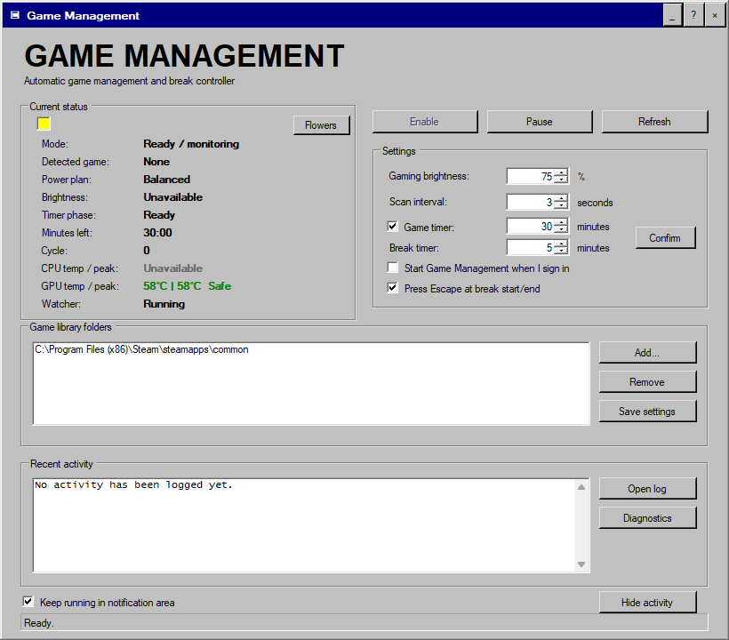
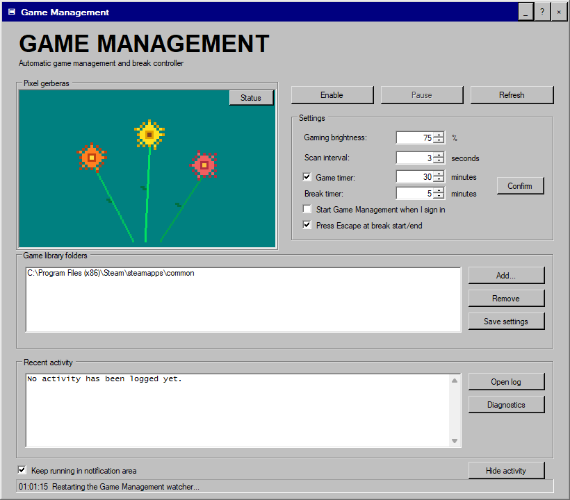
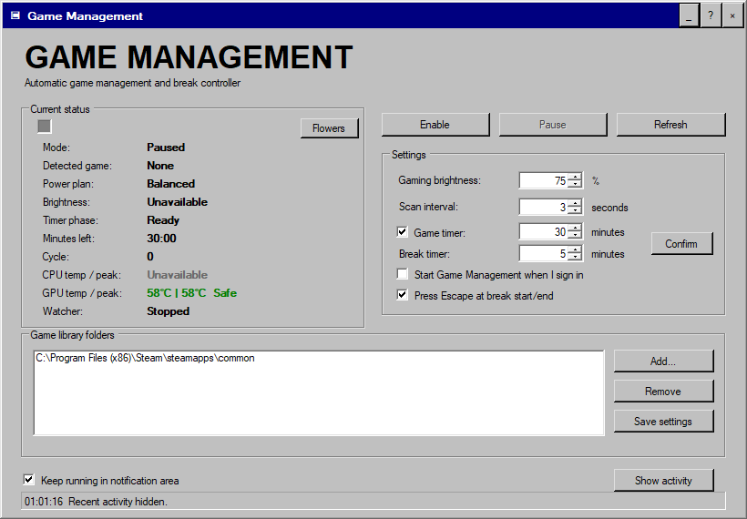

# Game Management

Game Management is a Windows desktop game-and-work session utility with a deliberately retro Windows 98 interface. Its Game tile detects games, applies a dedicated AC-only performance plan, controls supported built-in display brightness, and restores the previous system state when play stops. Its Work tile monitors only applications the user selects and provides focus/break timing without gaming power, brightness, or Escape behavior. It does not change process priority.

> **Notice:** This code was created entirely by AI. The application is intended for personal use only.



## Features

- Automatic game detection across selected installed applications, configured folders, and Steam libraries
- Optional foreground-app switching between Game and Work modes, with a manual override
- Whole-interface flip between Game Management and Work Management
- Exact executable picker for user-selected work applications such as VS Code, Eclipse, or Chrome
- Work focus sessions that do not apply gaming power, brightness, or Escape behavior
- AC-power-only activation
- Dedicated Windows power plan with exact plan restoration
- No game process-priority changes
- Configurable gaming brightness with restoration
- Repeating game/work and break timers with a visible alarm and independent persistent completed-cycle counters
- Per-mode Reset Timer, Reset Cycles, and confirmed Reset All controls
- Pause/resume keeps the exact timer phase, cycle, and remaining time
- Visible Resume and Pause controls in Work Mode use the same frozen-timer behavior
- Consistent Windows 98 styling across the main window, timer alarm, session summary, and installer
- Optional automatic Escape key at break start/end, sent only to the verified game window
- Timer completion opens only the alarm dialog instead of bringing forward the dashboard
- Live CPU/GPU temperatures, color conditions, and per-session temperature peaks
- Read-only CPU-temperature integration with an already-running MSI Afterburner
- Session history with mode, applications, date/time, duration, cycles, and CPU/GPU peaks
- Searchable session history plus navigable weekly and monthly reports
- Interrupted-session recovery with unique-ID protection against duplicate history entries
- Portable `.gmbak` backup and restore for settings and session history
- Independent choices for timer popups, timer sound, and end-of-session summaries
- Sessions lasting exactly two minutes or less are ignored
- Taskbar and notification-area controls
- Low-overhead idle tray mode with full one-second temperature monitoring during games
- Responsive controls with background sensor reads and immediate watcher wake-ups
- Activity log hidden on startup and available through Show activity
- Configurable single-instance launch at Windows sign-in
- Live timestamp-based `HH:MM:SS` Work Mode session timer
- Independent Work focus and break timer settings and state; Game timer settings remain separate
- Installed-application picker with recognizable names and icons in both Game and Work modes, plus manual executable browsing
- Weekly and monthly Reports with separate Game and Work totals, daily activity, and single-app time when recorded
- Animated Windows 98-style pixel-gerbera panel
- Single-file graphical installer and registered uninstall support

## Hardware compatibility

The universal Windows installer supports desktop and laptop PCs using NVIDIA GeForce RTX 20- or 30-series graphics, including Ti, SUPER, and Laptop GPU variants. RTX detection is informational. On NVIDIA systems, the dashboard uses a read-only `nvidia-smi` temperature query; Game Management does not change NVIDIA drivers, clocks, voltages, firmware, thermal targets, or vendor performance modes.

Setup uses the current user's resolved Documents folder, falls back to a compatible Windows power-plan base when needed, and skips optional power settings that a PC's firmware does not expose. The application can also run with other GPU brands; built-in display brightness control remains optional and unsupported external monitors are left unchanged.

## Install

Download and run [`GameManagement-Setup.exe`](dist/GameManagement-Setup.exe). Windows may show an Unknown publisher warning because the executable is not digitally signed.

The [v3.2.1 release](https://github.com/Ulxqp/Game-Management/releases/tag/v3.2.1) also provides a compressed application ZIP and SHA-256 checksums. Installed source, test scripts, and documentation use their own folders. Runtime files and personal data stay at their established paths. Release assets exclude personal logs, history, and timer state and are each smaller than 1 GB.

The installer places the application in `Documents\GameManagement`, creates Desktop and Start Menu shortcuts, starts the watcher, and adds Game Management to Windows Installed Apps. Existing settings are preserved during upgrades.

## Safety

Game Management does not control process priority, fan firmware, BIOS settings, voltages, thermal modes, thermal limits, or CPU/GPU clocks. Its temperature monitor is read-only. On this Lenovo, CPU temperature can be read from MSI Afterburner's monitoring data while MSI Afterburner is running; otherwise Lenovo/Windows fallbacks are tried and Unavailable is shown. Game Management only activates on AC power. Pausing or uninstalling restores the captured power plan and brightness. Setup also restores a legacy priority snapshot if an older version left one behind during an interrupted session.

## Build from source

On 64-bit Windows with .NET Framework 4 installed:

```powershell
powershell.exe -NoProfile -ExecutionPolicy Bypass -File .\Build-GameManagement.ps1
```

This compiles the AnyCPU application, runs the safety, feature, and RTX compatibility tests, and creates the single-file installer both one directory above the source folder and in `dist`.

## Verification

The v3.2.1 package was checked on October 8, 2026. Foreground assignment classification, automatic/manual mode switching, independent frozen timer state, Game/Work pause and resume, reset isolation, persistent completed-cycle counting, duplicate-cycle prevention, report calculations, and interrupted-session recovery were verified. Hidden idle operation avoids unnecessary sensor and display work; foreground detection uses one lightweight Windows API check per second. The watcher contains no process-priority controls, and MSI Afterburner CPU temperature access remains read-only.

- AnyCPU application and installer compilation: **PASS**
- PowerShell safety, identity, sensor-access, portability, optimization, Game/Work isolation, timer persistence, recovery, backup, notifications, and interface-alignment suite: **65/65 checks passed**
- Foreground classification, report/history, frozen-timer, reset-isolation, cycle-counting, and crash-recovery behavior suite: **15/15 checks passed**
- Embedded installer payload verification: **PASS** (exit code 0)
- RTX 20/30 compatibility classifier: **PASS** (exit code 0)
- Non-installing setup-window render smoke test: **PASS** (exit code 0)
- Root and `dist` installer copies: **identical**

The classifier test covers representative RTX 2060, 2070 SUPER, 2080 Ti, 3050 Laptop, 3060 Ti, 3070, 3080 Laptop, and 3090 names. This verifies detection and hardware-independent setup behavior; it is not a claim that the application was physically tested on every GPU model or PC configuration.

## Screenshots





## Project files

- `GameManagement.cs` — desktop interface
- `GameManagement.ps1` — background game/work watcher and timer controller
- `Install-GameManagement.ps1` — installation/configuration helper
- `Pause-GameManagement.ps1` — safe pause and restoration helper
- `Undo-GameManagement.ps1` — full restoration helper
- `Uninstall-GameManagement.ps1` — Windows uninstall workflow
- `GameManagementSetup.cs` — single-file graphical installer
- `Test-GameManagementFeatures.ps1` — local report, notification, rendering, and crash-recovery tests

See [CHANGELOG.md](CHANGELOG.md) for update history.
